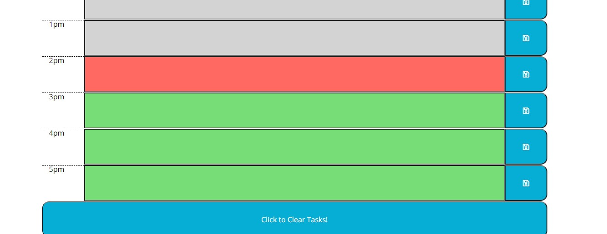

# Work Day Scheduler&middot;  

## Deployed Site:

Repository Link = https://github.com/ChrisAMK/JavaScript-Daily-Planner.git

Deployed Site Link = https://chrisamk.github.io/JavaScript-Daily-Planner/index.html

## Description 
For the weeks homework we are tasked to create a Work Day Scheduler that tracks all the tasks in the users day, stores then to Local Storage so that when the page is refreshed, the Tasks stay put. At first the task looked to be quite complicated but once the layout was done it was all good. The main task was to have the user input texts, then grab that text and put it into local storage, also display any current text that is in the Local Storage. They are many ways to store into Local storage but considering it was just one string, i didn't bother with objects, or JSON.

## Table of Contents 
* [Installation](#Installation)
* [Usage](#Usage)
* [License](#License)
* [Contributions](#Contributions)
* [Tests and Examples](#Tests)
* [Questions](#Questions)

## Installation  
No installation required, just click on the provided deployment link above

## Usage  
to help users keep track of their days tasks

## License  
Academic Free License v3.0

[Click Here to go to License Site!](https://opensource.org/licenses/AFL-3.0)

## Tests and Examples  
User has a meeting at 2pm so he enters in the text area and is shown with a color code how far away that meeting is

## Questions  
If there are any questions feel free to reach me at [Github](https://github.com/ChrisAMK)

or E-mail me at chriskl@live.com

